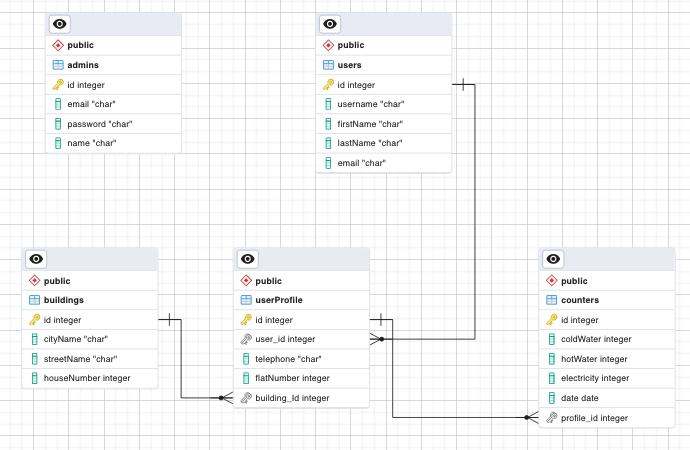

# ТСЖ портал
SaaS решение для ТСЖ и УК. Экосистема включает в себя:
Портал - работа с подведомственными зданиями/помещениями; ведение списка жильцов и мониторинг данных показаний счетчиков.
[Мобильное приложение](https://github.com/kikirilll/tsj_mobile) - единый инструмент жильцов для коммуникации с управляющей компанией. В мобильном приложении можно подать показания счетчиков, смотреть историю показаний, оставлять заявки на выполнение работ.

## База данных

## Запуск проекта
Проект построен на Django Framework. Стандартный запуск:
'''
python manage.py runserver
'''

Так же проект готов для запуска в Docker.